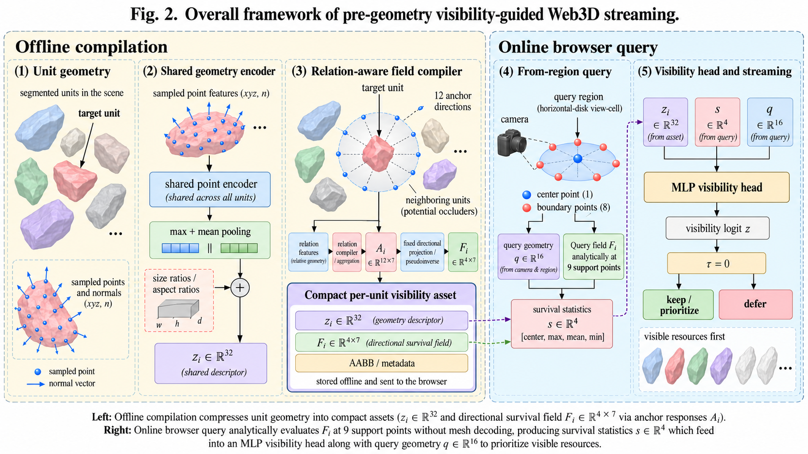
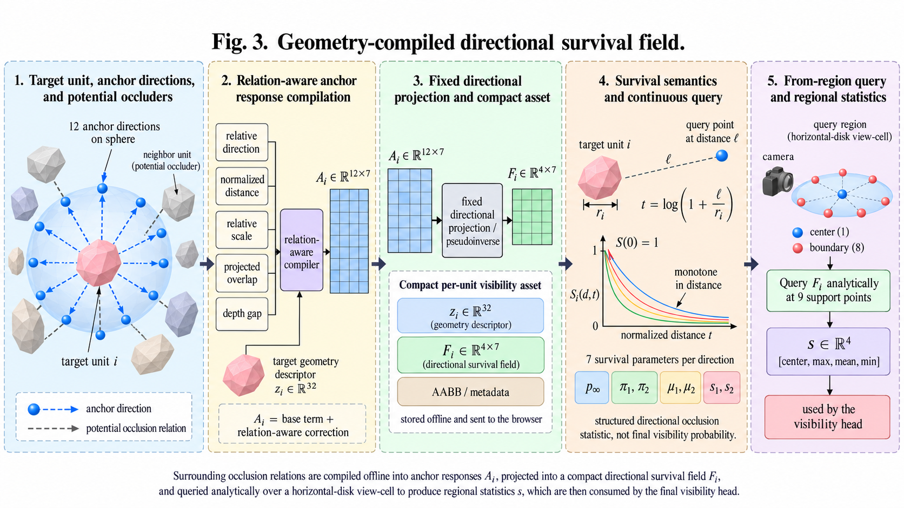

# 论文总体大纲

## 暂定题目

**Pre-Geometry Visibility for Progressive Web3D via Geometry-Compiled Occlusion Fields**  
**面向渐进式 Web3D 的几何编译遮挡场与几何下载前可见性预测**

## 摘要

大规模 Web3D 场景采用渐进式传输，以降低交互启动阶段的数据加载开销。遮挡信息能够辅助内容选择，但依赖场景几何的在线可见性计算难以直接用于详细几何尚未到达客户端的阶段。本文研究几何下载前的区域潜在可见性预测，并提出 Geometry-Compiled Occlusion Fields（GCOF-PVS）。该方法在离线阶段联合编码可独立剔除单元的局部表面几何及周围潜在遮挡关系，将场景上下文编译为紧凑的方向生存场。在线阶段通过少量解析支持点查询提取区域遮挡统计量，并结合局部几何描述符与相机参数预测单元可见性。训练目标针对可见内容误剔与不可见内容冗余保留的非对称代价，在提高剔除效率的同时约束可见内容遗漏。评价覆盖区域可见性、表征与目标消融、跨场景迁移、运行与存储开销，以及固定带宽下的渐进式传输效果。

**结果占位：** 可见性安全性与剔除效率［待填写］；跨场景迁移结果［待填写］；客户端查询与资产开销［待填写］；渐进式传输收益［待填写］。

**关键词：** 区域可见性；潜在可见集；遮挡剔除；神经场；Web3D；渐进式传输。

---

# 1. 引言（Introduction）

## 1.1 渐进式场景访问与可见性需求

大规模 Web3D 场景的几何数据通常无法在交互开始前全部传输。客户端需要根据观察状态确定内容的请求顺序，并在有限带宽与内存条件下逐步恢复当前画面。视锥、距离、空间层次及屏幕空间误差能够提供内容选择依据，但处于视锥内、距离较近的单元仍可能被前景结构完全遮挡。因而，遮挡相关性是渐进式内容选择的重要补充信息。

区域潜在可见集（from-region potentially visible set，PVS）描述一个观察区域内可能出现的内容。相较于单视点可见性，它能够覆盖局部相机移动引起的显露变化，为内容预取和区域内结果复用提供依据。

## 1.2 几何下载前的可见性问题

预计算 PVS 将可见性分析移至离线阶段，在线 PVS 则利用已有场景表示执行区域查询。学习式方法进一步以神经网络近似可见性计算。这些方法分别在存储、预处理和查询开销之间取得不同平衡，但详细内容尚未到达的 Web 客户端仍需要一个可直接使用的遮挡相关性表示。

本文关注的约束是：客户端执行可见性查询时，待选择内容的详细几何尚未驻留。离线内容构建阶段可以访问完整几何及可见性监督；运行时则仅使用提前传输的紧凑资产。该设置将可见性表示的生成与详细场景内容的传输分离。

## 1.3 方法概述

GCOF-PVS 以可独立剔除单元为基本对象，分别描述目标自身形状和周围潜在遮挡关系。共享编译器将方向相关的场景上下文压缩为低阶方向生存场。该场以连续方向和归一化距离为查询变量，通过解析求值形成区域统计量，再由轻量预测头输出单元级可见性分数。

离线阶段承担几何编码与遮挡上下文聚合，客户端仅保留紧凑单元表示及共享查询模型。预测分数分别服务于区域 PVS 过滤和渐进式内容排序；保守训练目标用于控制可见单元被错误剔除的风险。

## 1.4 主要贡献

1. 面向渐进式 Web3D，构建详细几何到达客户端之前的区域可见性预测框架，将遮挡相关性作为可提前传输、可在线查询的场景表示。
2. 提出几何编译方向生存场，联合局部表面几何与潜在遮挡关系，以紧凑系数表示方向—距离相关的遮挡响应，并支持轻量区域查询。
3. 建立统一的单元级评价体系，分析可见性安全性、剔除效率、既有三组消融、跨场景迁移及渐进式传输中的运行成本与应用收益。

### 配图：图 1——应用效果概览

> **［图 1 占位：相同传输预算下的渐进式场景恢复］**  
> 文件：`paper/figures/fig01-teaser.png`。

<!-- 上传后启用： -->

**图面内容：** 同一场景、相机与传输预算下的基线画面、本文方法画面及完整参考画面；配合一处遮挡区域局部放大，展示已到达的可见内容与缺失内容。图中附实际传输量和可见贡献覆盖率。

**图注：** 相同内容传输预算下的渐进式场景恢复。各方法使用相同候选单元与初始缓存状态，仅改变内容优先级。参考画面由完整场景生成，局部放大区域显示可见内容的恢复情况。

---

# 2. 相关工作（Related Work）

## 2.1 遮挡剔除与区域潜在可见集

可见性算法可以按照观察域区分为单视点可见性（from-point visibility）和区域可见性（from-region visibility），也可以按照结果的保守性、预处理需求及场景表示进一步分类 [1](../references/core-literature.md#ref-01)。单视点方法针对当前相机剔除被遮挡的几何，而区域潜在可见集（PVS）需要保留观察区域内任一允许视点可能看到的内容。后者能够支持局部相机运动下的内容复用和预取，但必须处理更多视线之间的遮挡关系。

在几何已驻留的渲染流水线中，Hierarchical Z-buffer 利用层次深度表示拒绝被遮挡对象 [2](../references/core-literature.md#ref-02)；Coherent Hierarchical Culling 将空间层次、时间相干性与硬件遮挡查询结合，降低等待查询结果造成的流水线停顿 [3](../references/core-literature.md#ref-03)。CHC++ 进一步改进可见性预测和查询批处理 [4](../references/core-literature.md#ref-04)。Masked Software Occlusion Culling 则通过深度与覆盖信息的分离提高软件光栅化剔除效率 [5](../references/core-literature.md#ref-05)。这些方法主要减少已经可访问内容的渲染工作量；将其用于下载前决策时，还需提供用于生成遮挡信息的几何、代理或已有深度。

区域 PVS 的经典路线是预先划分观察空间并存储区域可见集合。Teller 与 Séquin 利用建筑模型中的空间单元和通道关系进行可见性预处理 [6](../references/core-literature.md#ref-06)。Wonka 等在城市场景中研究遮挡体融合，使多个遮挡体的共同作用参与区域剔除 [7](../references/core-literature.md#ref-07)。Nirenstein 等通过线空间构造精确的区域可见性计算 [8](../references/core-literature.md#ref-08)。与解析求解不同，硬件加速自适应采样 [9](../references/core-literature.md#ref-09)、Guided Visibility Sampling [10](../references/core-literature.md#ref-10) 和 Adaptive Global Visibility Sampling [11](../references/core-literature.md#ref-11) 通过采样、射线变异或跨观察区域的信息共享提高预处理效率。这些工作建立了预处理代价、可见集合紧致程度与存储规模之间的不同折中。预计算 PVS 本身即可支持不依赖详细几何的运行时查表，因此，本文的差异不在于首次将可见性计算前置，而在于使用紧凑、连续可查询的单元表示替代逐区域存储的集合结果。

在线区域 PVS 将计算移到实际查询时刻，从而适应变化的观察区域。Dual Ray Space 通过二维对偶射线表示与图形硬件计算区域可见性，并以大型环境的远程漫游为应用背景 [12](../references/core-literature.md#ref-12)。Camera Offset Space 将相机位移与逐片元信息结合，用于流式渲染中的实时 PVS 生成 [13](../references/core-literature.md#ref-13)。Guided Visibility Sampling++ 利用硬件光线追踪加速区域可见性的渐进采样 [14](../references/core-literature.md#ref-14)。Trim Regions 通过在图像空间侵蚀物体轮廓实现遮挡体收缩，并结合分层场景遍历计算一般三维场景的区域 PVS [15](../references/core-literature.md#ref-15)。Disocclusion Buffer 以量化深度的稀疏分层场景表示显式计算显露区域，将顺序相关的遮挡传播转化为可并行处理的显露计算 [16](../references/core-literature.md#ref-16)。

上述在线方法已直接面向流式或远程渲染，不能将“PVS 可用于传输”作为与它们的区别。本文关注可见性计算在客户端的数据前提：几何相关的上下文分析在内容准备阶段完成，客户端查询时仅使用已编译资产，而不再构建相应的场景光栅化或射线求交表示。

## 2.2 学习式可见性表示

逐元素可见性并不必然依赖显式表面重建。Katz 等提出的 Hidden Point Removal 通过点集变换与凸包计算估计给定视点的可见点，为直接在离散元素上处理可见性提供了基础 [17](../references/core-literature.md#ref-17)。逐元素表示为对象级或更细粒度的可见性预测提供了不同于图像深度查询的切入点。

NeuralPVS 是与本文最接近的学习式区域 PVS 方法 [18](../references/core-literature.md#ref-18)。该方法将场景几何转换为与扩展视锥对齐的 froxel 网格，通过稀疏卷积和三维交错表示预测区域可见网格，并使用合成场景进行训练。固定网格分辨率限制了神经推理的输入规模，但查询仍包含从可访问场景几何生成输入表示的步骤。与此不同，GCOF-PVS 将目标局部几何和周围遮挡关系离线编译为单元描述符及方向场；运行时输入为紧凑系数与当前观察区域。两者的区别在于场景上下文进入计算链的位置和查询表示，而非仅在于网络大小。

Neural Visibility of Point Sets 将点集可见性表述为学习问题，利用三维 U-Net 提取视点无关特征，再结合观察方向预测逐点可见性 [19](../references/core-literature.md#ref-19)。其计算对象是点集中的元素，与本文的独立剔除单元具有不同粒度。

NVGS 将已有三维 Gaussian 资产的视点相关可见性编码为轻量神经表示，在光栅化之前剔除不可见 Gaussian [20](../references/core-literature.md#ref-20)。这说明可见性知识可以通过离线处理换取低成本在线查询。NVGS 主要减少已驻留 Gaussian 的渲染开销，本文则估计局部观察区域中的单元可见性，以支持详细内容到达之前的选择与排序。二者的离线阶段均可利用场景信息，其任务差异不取决于是否生成目标场景的可见性标签。

在光照传输中，NeRV 以神经可见性场辅助反射与重光照计算，体现了连续位置—方向可见性函数的表示价值 [21](../references/core-literature.md#ref-21)。本文的方向生存场采用受约束的方向—距离函数，但其输出是用于 PVS 预测的中间遮挡特征，而非经过物理标定的光线透射概率。相关工作的共同基础是将几何相关的可见性查询转化为紧凑函数；本文进一步关注该函数的可传输性、区域查询代价和单元级剔除用途。

## 2.3 可见性感知的三维内容传输

渐进式几何表示为按需访问大型三维内容提供了基础。Progressive Meshes 使用基础网格与逐步细化记录表示几何 [22](../references/core-literature.md#ref-22)，视点相关细化进一步根据观察状态分配几何细节 [23](../references/core-literature.md#ref-23)。Streaming QSplat 基于多分辨率包围球层次，由客户端按当前视点从粗到细请求模型内容 [24](../references/core-literature.md#ref-24)。这些方法主要解决表示分辨率与内容到达顺序的协同问题。

可见性同样长期用于选择性传输。Dual Ray Space 已将在线区域可见性用于远程环境访问 [12](../references/core-literature.md#ref-12)。Smart Visible Sets 在区域 PVS 的基础上进一步按观察方向和距离组织内容，以适应客户端观察参数和重要性选择 [25](../references/core-literature.md#ref-25)。View-Dependent Streaming of Progressive Meshes 根据当前视点的视觉重要性调整细化数据的传输 [26](../references/core-literature.md#ref-26)；Streaming HLODs 将层次化细节表示与外存、网络访问结合，以已到达的粗层次表示支撑交互过程 [27](../references/core-literature.md#ref-27)。因此，将 PVS 或可见性分数用于传输优先级并非本文单独提出的机制；本文研究的是详细几何尚未到达时，客户端如何获得可连续查询的遮挡相关性。

面向 Web3D，Lightweight Progressive Meshes 联合构件相似性与渐进网格，以减少冗余几何并支持渐进访问 [28](../references/core-literature.md#ref-28)。CEBOW 将传输调度、缓存管理和初始加载组织到云—边缘—浏览器架构中 [29](../references/core-literature.md#ref-29)。Fine-Grained Web3D Culling-Transmitting-Rendering Pipeline 进一步协同服务器 PVS 剔除、网络传输与浏览器增量实例渲染 [30](../references/core-literature.md#ref-30)。这些工作表明，网络和渲染收益取决于整个流水线的协同；单独提高可见性分类指标，并不能替代对实际传输过程的评价。

3D Tiles 标准以空间层次、包围体、几何误差及请求相关元数据组织大规模场景，使客户端在尚未取得详细内容时即可进行访问与细化决策 [31](../references/core-literature.md#ref-31)。本文与这种元数据驱动的选择方式互补：在已有候选选择之上，加入可由紧凑资产查询的遮挡信息。方法的核心不是替换层次遍历或调度器，而是提供面向独立剔除单元的几何下载前区域可见性表示。

**图表配置：** 表 1 按查询输入、预处理资产、计算位置、可见性粒度和流式应用方式对照代表方法；本节不另设架构图。

---

# 3. 问题设置与区域采样（Preliminaries and Regional Sampling）

## 3.1 可见性单元与观察区域

场景由可独立剔除单元集合 $\mathcal U=\{u_i\}_{i=1}^{N}$ 构成。BIM 场景以构件为单元；标准图形学场景使用登记并冻结的几何划分规则。每个单元具有标识、世界空间 AABB 和表面几何。

一个 view-cell 由区域中心 $\mathbf c$、水平圆盘半径 $r$、固定相机朝向和投影参数共同定义。圆盘位于世界 $X$–$Z$ 平面：

$$
\mathcal B(\mathbf c,r)
=\left\{\mathbf x:\ (x_X-c_X)^2+(x_Z-c_Z)^2\le r^2,\ x_Y=c_Y\right\}.
$$

区域内相机可以水平移动，但高度、朝向和投影参数保持固定；不同高度由不同区域中心表示。后文将附带固定观察参数的圆盘简记为 $\mathcal B$。

## 3.2 后退视锥与候选覆盖

单一中心视锥无法包含区域内相机平移后所有可能进入视野的内容。区域 PVS 方法可通过后退观察位置和扩大视场角构造前置场景范围，相关构造见 Trim Regions 与 NeuralPVS [15](../references/core-literature.md#ref-15)、[18](../references/core-literature.md#ref-18)。本文在这一思路下冻结单元级候选协议，先定义候选范围，再进行学习式遮挡预测。

记中心相机的前向单位向量为 $\mathbf v$，真实显示视场角为 $\theta_{\mathrm{view}}$，覆盖视场角为 $\theta_{\mathrm{cov}}$。虚拟候选相机的位置为：

$$
\mathbf c'=\mathbf c-\Delta\mathbf v,
\qquad
\Delta=\frac{r}{\tan(\theta_{\mathrm{view}}/2)},
\qquad
\theta_{\mathrm{cov}}=\theta_{\mathrm{view}}+2\beta.
$$

当前协议取 $\theta_{\mathrm{view}}=60^\circ$、$\theta_{\mathrm{cov}}=66^\circ$，因而在该视场角口径下两侧角度余量为 $\beta=3^\circ$。后退距离使用真实显示视场角的半角，而不是将分母替换为覆盖视场角的半角。相机宽高比、近远裁剪面与场景半径按登记配置固定。

由虚拟相机 $\mathbf c'$ 的扩展视锥 $\mathcal F_{\mathrm{cov}}$ 对单元 AABB 进行相交测试，生成候选集合：

$$
\mathcal C(\mathcal B)=
\{u_i\in\mathcal U:\operatorname{AABB}(u_i)\cap\mathcal F_{\mathrm{cov}}(\mathbf c')\ne\varnothing\}.
$$

该集合在模型预测和 GT 标注之外独立构造。后退与角度余量用于扩大候选范围，不执行遮挡判定；它们也不单独构成连续圆盘覆盖的数学证明。协议要求对实际采样 GT 检查包含关系，发现遗漏时登记候选构造失败，不通过补入 GT 单元修复。$\beta$ 在本文中表示投影视场余量，不额外授予区域缓存对相机旋转的复用保证。

## 3.3 离线区域可见性标注

合法区域中心依据可通行空间、建筑周边、开阔区域和高度层生成，并检查与场景几何的安全距离。每个物理中心展开水平角 $0^\circ,90^\circ,180^\circ,270^\circ$ 与俯仰角 $-15^\circ,0^\circ,15^\circ$，形成十二个离线观察方向。该方向配置用于数据覆盖，不要求运行时相机吸附到离散方向。

对于每个固定方向，在水平圆盘内取包含中心在内的 32 个相机位置，其余位置采用冻结的面积均匀采样规则。全部位置以相同朝向、高度和 $66^\circ$ 投影执行硬件 Color-ID 渲染。记第 $m$ 个位置的可见单元集合为 $V(\mathbf c_m)$，则区域 GT 与单元视觉权重为：

$$
\mathcal V_{\mathrm{GT}}(\mathcal B)=\bigcup_{m=1}^{32}V(\mathbf c_m),
\qquad
w_i(\mathcal B)=\max_{m=1,\ldots,32}w_i(\mathbf c_m).
$$

$w_i(\mathbf c_m)$ 为该采样图像中的单元屏幕覆盖贡献。可见并集描述“在采样区域内可能出现”的单元，而非中心视点的瞬时可见集；最大覆盖量则保留该单元在局部观察变化中可能达到的视觉重要性。

每条样本必须满足：

$$
\mathcal V_{\mathrm{GT}}(\mathcal B)\subseteq\mathcal C(\mathcal B).
$$

该检查验证冻结采样位置下的候选覆盖。32 位置标注属于采样区域近似，不等价于对连续圆盘中所有视点的穷举。

## 3.4 数据划分与在线查询约定

每个 view-cell 的中心、方向、半径、投影参数、候选 ID、可见 ID 和视觉权重组成一条 CSR 样本。训练、校准、验证和测试按物理中心分组；同一中心的十二个方向和所有内部采样位置保持在同一划分中，避免高度相关的区域数据跨集合泄漏。

在线阶段使用当前相机建立区域锚点，按上述规则独立生成候选，再执行一次批量预测。离线 32 个相机用于生成 GT；V5 的中心加八个圆周支持点用于一次预测内部的解析特征计算，均不要求客户端额外渲染采样视图。

**图表配置：** 本节以前置定义、公式与数据协议表说明采样原理，暂不加入后退视锥示意图。表 2 在实验设置中列出各场景的具体半径、中心规模与划分。

---

# 4. 方法（Method）

## 4.1 总体框架

在第 3 节定义的候选集合上，GCOF-PVS 预测每个单元的区域可见性分数。离线编译阶段输出局部描述符 $z_i$ 和方向场系数 $F_i$；在线阶段生成区域统计量 $s_i$ 与查询几何 $q_i$，由共享预测头产生 logit $\xi_i$：

$$
(z_i,F_i)=\operatorname{Compile}(u_i,\mathcal N_i),
\qquad
\xi_i=f_{\Theta}(z_i,s_i,q_i).
$$

其中 $\mathcal N_i$ 表示目标周围的潜在遮挡上下文。$z_i$ 表示几何描述符，$\xi_i$ 表示最终可见性 logit。

### 配图：图 2——整体架构

**图面内容：** 左侧为单元表面输入、共享几何编码器和关系编译器；中间为紧凑资产；右侧为圆盘区域查询、查询几何构造及可见性预测。图中分别显示 $z_i$ 到预测头、$F_i$ 到解析查询的传输路径，以及相机与目标元数据到 $q_i$ 的路径。简单网络以概念模块表示，张量尺寸仅标注关键表示。

**图注：** GCOF-PVS 的离线编译与在线查询。共享编码器生成 $z_i\in\mathbb R^{32}$，关系编译器生成方向响应 $A_i\in\mathbb R^{12\times7}$，经固定投影得到 $F_i\in\mathbb R^{4\times7}$。客户端读取紧凑资产，在水平圆盘的九个支持点上解析求值，形成 $s_i\in\mathbb R^4$。相机、观察区域与目标相对几何构成 $q_i\in\mathbb R^{16}$；预测头联合 $z_i,s_i,q_i$ 输出单元分数，用于区域过滤和渐进式排序。九个支持点仅用于解析计算，不产生额外渲染视图。

## 4.2 局部表面几何编码

每个单元固定采样 256 个表面点，每点由归一化位置与法向组成。共享逐点网络提取特征，经最大池化和均值池化后，与三个尺寸比例拼接，生成局部描述符：

$$
z_i=E_{\Theta}(P_i,\mathbf a_i)\in\mathbb R^{32}.
$$

其中 $P_i\in\mathbb R^{256\times6}$，$\mathbf a_i\in\mathbb R^3$ 为尺寸比例。当前逐点网络为 $6\rightarrow32\rightarrow64\rightarrow64$，池化后的单元网络为 $131\rightarrow64\rightarrow32$。该描述符编码目标形状，同时作为周围单元参与关系聚合时的几何输入。

**配图位置：** 对应图 2 的共享编码器部分；池化特征与尺寸比例采用拼接，网络层宽列入实现说明，不另设网络结构图。

## 4.3 潜在遮挡关系与方向响应编译

以目标单元为中心设置 12 个正二十面体方向锚点。沿每个方向对单元 AABB 进行正交投影，根据投影重叠、相对深度和尺度归一化间距选择最多八个潜在遮挡单元。锚点是模型内部的方向采样，与数据集中的相机方向配置相互独立。

设目标与来源单元的中心分别为 $\mathbf o_i,\mathbf o_j$，尺度为 $\rho_i,\rho_j$。关系特征 $e_{ijk}\in\mathbb R^8$ 包含三维相对方向、对数归一化距离、对数尺度比、两种投影重叠比例及归一化深度间隔。

共享消息网络同时接收目标描述符、来源描述符与关系特征：

$$
m_{ijk}=\operatorname{MLP}_{e}([z_i,z_j,e_{ijk}]),
\qquad
h_{ik}=\sum_{j\in\mathcal N_{ik}}\alpha_{ijk}m_{ijk}.
$$

注意力权重在同一目标—方向组内归一化。邻居数量和投影重叠总量作为附加统计，保留平均聚合中可能损失的关系规模信息。

每个方向的输出由目标自身的基础响应和关系修正构成：

$$
a_{ik}=b_{\Theta}(z_i,\boldsymbol\omega_k)
+\mathbf1[|\mathcal N_{ik}|>0]\,\delta_{\Theta}(h_{ik},n_{ik},o_{ik},\boldsymbol\omega_k).
$$

十二个七维响应组成 $A_i\in\mathbb R^{12\times7}$。这些响应是后续生存函数参数的原始值，而非十二个可见性概率。

**配图位置：** 图 3 左侧显示目标中心球面、方向锚点、潜在遮挡体及关系聚合；目标与来源描述符均具有明确输入连线。

## 4.4 几何编译方向生存场

### 4.4.1 连续方向参数化

离散方向响应投影至固定一阶方向基：

$$
\phi(\boldsymbol\omega)=[1,\omega_x,\omega_y,\omega_z],
\qquad
\Phi_{k,:}=\phi(\boldsymbol\omega_k).
$$

令 $\Phi\in\mathbb R^{12\times4}$，则场系数及任意单位方向的原始响应为：

$$
F_i=\Phi^{+}A_i\in\mathbb R^{4\times7},
\qquad
\eta_i(\boldsymbol\omega)=\phi(\boldsymbol\omega)F_i\in\mathbb R^7.
$$

固定伪逆执行低阶最小二乘投影，将 84 个锚点响应压缩为 28 个系数。投影一般不精确重建全部锚点响应；其作用是限制方向表达的复杂度，并形成连续查询接口。该方向为目标到查询位置的方向，不等同于相机自身的朝向。

### 4.4.2 生存函数形式与参数含义

方向生存场采用“随距离增加，尚未发生遮挡的响应不增加”的函数形式，作为遮挡上下文的结构化中间表示。记目标到查询位置的世界距离为 $\ell$，目标尺度为 $\rho_i$，归一化距离为：

$$
t=\log\left(1+\frac{\ell}{\rho_i}\right).
$$

原始方向响应 $\eta_i$ 经变换得到一个无命中质量、两个混合权重、两个位置参数及两个尺度参数：

$$
p_{\infty}=\operatorname{sigmoid}(\eta_0),
\qquad
(\pi_1,\pi_2)=\operatorname{softmax}(\eta_1,\eta_2),
$$

$$
(\mu_1,\mu_2)=\operatorname{softplus}(\eta_{3:5}),
\qquad
(\sigma_1,\sigma_2)=0.02+\operatorname{softplus}(\eta_{5:7}).
$$

位置参数控制归一化距离上的主要过渡位置，尺度参数控制过渡宽度。两个分量提供不同距离尺度的平滑下降模式；它们不预设对应两个真实遮挡体。

令 $\operatorname{sp}(x)=\log(1+e^x)$，两个零点截断并归一化的 logistic 生存分量为：

$$
g_j(t)=\exp\left[
\operatorname{sp}\left(-\frac{\mu_j}{\sigma_j}\right)
-\operatorname{sp}\left(\frac{t-\mu_j}{\sigma_j}\right)
\right],\qquad j\in\{1,2\}.
$$

最终场响应为：

$$
S_i(\boldsymbol\omega,\ell)
=p_{\infty}+(1-p_{\infty})\sum_{j=1}^{2}\pi_j\,
 g_j\!\left(\log\left(1+\frac{\ell}{\rho_i}\right)\right).
$$

所有分量参数随查询方向变化。固定方向下，该函数满足：

$$
S_i(\boldsymbol\omega,0)=1,
\qquad
\frac{\partial S_i(\boldsymbol\omega,\ell)}{\partial\ell}\le0,
\qquad
\lim_{\ell\to\infty}S_i(\boldsymbol\omega,\ell)=p_{\infty}.
$$

上述性质约束的是中间场响应，而非最终单元可见性。生存场不是体素网格，也不是逐视点 PVS 表；它是以目标为中心、由有限系数表示的方向—距离函数。

### 4.4.3 表征学习

当前正式 V5 由最终 PVS 目标端到端训练生存场，不单独使用遮挡距离监督或 field-NLL。因而，场值不解释为经过标定的物理可见概率，位置参数也不直接等同于真实遮挡距离。该表征的作用是在有限资产容量下引入低阶方向结构、归一化距离和径向单调性。

### 配图：图 3——生存场构建与区域查询

**图面内容：** 以目标中心球面展示十二个方向锚点及周围遮挡体；关系编译输出 $A_i$，固定投影输出 $F_i$；随后展示目标到查询点的方向、距离、生存曲线及圆盘支持点的区域汇总。关系编码器以单一模块呈现，资产包装细节由图 2 承担，不重复展开。

**图注：** 方向生存场的编译与查询。潜在遮挡关系经共享编译器生成方向响应 $A_i$，固定一阶方向投影得到 $F_i$。任意目标到查询点的单位方向 $\boldsymbol\omega$ 与距离 $\ell$ 经解析函数得到生存响应。该响应在固定方向上关于距离单调不增，并在零距离处为一。圆盘中心及八个圆周支持点的响应汇总为 $s_i$，作为最终可见性预测的区域特征。曲线示意表示函数结构，不表示实测遮挡概率。

## 4.5 区域查询与最终可见性预测

对水平圆盘采用中心 $\mathbf x_0=\mathbf c$ 与八个等角圆周支持点：

$$
\mathbf x_k=\mathbf c+r\left[
\cos\left(\frac{2\pi(k-1)}8\right)\mathbf e_X+
\sin\left(\frac{2\pi(k-1)}8\right)\mathbf e_Z
\right],\quad k=1,\ldots,8.
$$

相对于目标中心 $\mathbf o_i$，每个支持点确定 $\ell_{ik}=\|\mathbf x_k-\mathbf o_i\|$ 与单位方向 $\boldsymbol\omega_{ik}$。解析查询得到 $S_{ik}=S_i(\boldsymbol\omega_{ik},\ell_{ik})$，并构造：

$$
s_i=\left[S_{i0},\ \max_{0\le k\le8}S_{ik},\
\frac19\sum_{k=0}^{8}S_{ik},\ \min_{0\le k\le8}S_{ik}\right]\in\mathbb R^4.
$$

最大、平均和最小响应均针对九个支持点，不是连续圆盘上经过证明的极值或积分。中心响应与区域变化信息共同输入预测头，学习与采样区域 PVS 标签之间的关系。

查询几何 $q_i\in\mathbb R^{16}$ 由相机与目标的相对方向、距离尺度、圆盘范围、视场角以及近远裁剪参数构建。它与生存统计量并行产生。最终输入与预测为：

$$
\xi_i=f_{\Theta}([z_i,s_i,q_i]),
\qquad
f_{\Theta}:\mathbb R^{52}\rightarrow\mathbb R^{32}\rightarrow\mathbb R.
$$

固定阈值下的区域预测集合为：

$$
\widehat{\mathcal V}(\mathcal B)
=\{u_i\in\mathcal C(\mathcal B):\xi_i\ge\tau\},\qquad \tau=0.
$$

**配图位置：** 图 2 的在线输入及预测头、图 3 的解析查询与统计量共同覆盖本节。

## 4.6 保守可见性学习

训练在不可见单元的冗余保留与可见单元的错误剔除之间建立非对称目标。以 logit $\xi$ 定义平滑代价：

$$
h_{\mathrm{keep}}(\xi)=\frac{\operatorname{softplus}(\xi)}{\ln2},
\qquad
h_{\mathrm{miss}}(\xi)=\frac{\operatorname{softplus}(-\xi)}{\ln2}.
$$

对于训练场景 $s$，记可见出现次数为 $G_s$、正例视觉权重总和为 $W_s$，采样校正系数为 $a_n$。权重归一化与两类风险为：

$$
\mu_s=\frac{W_s}{G_s},\qquad
\widetilde w_n=\rho+(1-\rho)\frac{w_n}{\mu_s},\qquad\rho=0.1,
$$

$$
J_{\mathrm{extra}}^{(s)}=\frac{\sum_{n:y_n=0}a_n h_{\mathrm{keep}}(\xi_n)}{G_s},
\qquad
R_s=\frac{\sum_{n:y_n=1}a_n\widetilde w_n h_{\mathrm{miss}}(\xi_n)}{G_s}.
$$

计数下限为小视觉贡献单元保留非零安全权重，归一化视觉权重体现遗漏的重要性。多个训练域通过 SmoothMax 聚合风险，并求解：

$$
\min_{\Theta}J_{\mathrm{extra}}
\quad\mathrm{s.t.}\quad R_{\mathrm{robust}}\le\epsilon_{\mathrm{safe}},
\qquad\epsilon_{\mathrm{safe}}=0.01.
$$

当前实现以域风险的指数移动平均计算在线 SmoothMax 权重，按域采样频率修正随机梯度，并更新一个共享对偶变量。该目标约束训练风险；实际安全性由独立评价集上的召回率、置信下界和误剔结果确定。

**图表配置：** 训练目标的影响纳入表 4 的 FULL 与 PBCE_OBJECTIVE 对照。训练曲线和分数分布属于补充分析，不列为新的模型消融。

---

# 5. 渐进式 Web3D 集成（Progressive Web3D Integration）

## 5.1 离线编译与资产传输

场景准备阶段执行表面采样、共享几何编码、关系构建与方向场编译。每个单元的核心浮点表示由 $z_i\in\mathbb R^{32}$ 和 $F_i\in\mathbb R^{4\times7}$ 构成，并与目标包围体、位置尺度及必要索引共同组织为查询资产。共享预测头权重独立存储。

客户端优先获得该资产，其后可在待选单元详细几何未到达时执行可见性查询。实际存储代价由导出资产测量，区分单元表示、元数据与共享权重，不以理论浮点数量代替最终传输字节数。

## 5.2 区域锚定与批量查询

以当前相机位置、朝向和投影参数建立水平圆盘锚点，按第 3.2 节构造后退扩展视锥并独立生成候选集合。随后对候选单元执行一次批量模型查询，得到区域可见性分数。

## 5.3 区域复用与当前帧过滤

当相机仍位于锚定圆盘内，且方向、相机高度及投影参数满足当前区域约定时，可复用区域预测。相机离开区域或上述条件改变时，重新建立锚点并查询。在线朝向不吸附于离线数据方向。

当前帧保留集由区域预测与真实显示视锥相交得到：

$$
\mathcal R_t=\widehat{\mathcal V}(\mathcal B)\cap\mathcal C_{\mathrm{view}}(\mathbf c_t).
$$

$\mathcal R_t$ 是待显示或处理的预测保留集，并非新的精确遮挡求解结果。区域过滤与单帧视锥过滤承担不同作用。

## 5.4 可见性引导的内容排序

连续分数 $\xi_i$ 用于对候选单元进行优先级排序，使高可见相关性内容优先进入传输与处理队列。阈值过滤和不设阈值的排序分别评价，避免因候选集合变化混淆排序收益。

**配图配置：** 本节复用图 2 的资产传输与浏览器分支。传输效果在图 1 与图 6 中展示。

---

# 6. 实验与评价（Evaluation）

## 6.1 实验设置与评价指标

实验覆盖 BIM、室内、村落和城市等真实场景，并使用合成场景补充训练结构。场景名称、单元数、几何规模、中心数、圆盘半径、数据划分和实验角色记录于表 2。数据生成与候选构造统一遵循第 3 节协议。

以可见单元为正类。对 pose $p$，记候选数为 $n_p=|\mathcal C_p|$，$TP_p$、$FP_p$、$FN_p$、$TN_p$ 分别表示正确保留、冗余保留、错误剔除与正确剔除的单元数。Aggregate 指标合并计数或权重后计算；pose-macro 指标先逐 pose 计算再等权平均。跨场景结果在场景内评价完成后等权汇总，避免大场景主导最终结果。

### 6.1.1 可见内容保留：Weighted Recall

不同单元的屏幕贡献差异显著。仅按数量计算召回率，会对少量像素的单元和大面积可见结构赋予相同遗漏代价。本文采用**视觉贡献加权召回率（Weighted Recall，WR）**，以第 3.3 节定义的区域最大屏幕贡献 $w_{pi}$ 对可见单元加权：

$$
\operatorname{WR}_{\mathrm{agg}}=
\frac{\sum_p\sum_{u_i\in\mathcal G_p\cap\widehat{\mathcal G}_p}w_{pi}}
{\sum_p\sum_{u_i\in\mathcal G_p}w_{pi}}.
$$

该指标衡量已保留的可见贡献比例，使屏幕贡献很小的遗漏与大面积缺失具有不同权重。这里的“小”指屏幕贡献，而非世界空间尺寸。普通 Visible Recall 同时报告，以避免高 WR 掩盖大量小单元遗漏；图像定性结果进一步呈现遗漏的实际形态。单元权重是视觉代价代理，不等同于最终像素误差。

WR 的单侧 95% 置信下界（Lower Confidence Bound，LCB）根据冻结协议对 pose 进行 bootstrap 重采样，反映估计的不确定性，而非每个 pose 或连续观察区域的确定性保证。

### 6.1.2 遮挡剔除能力：CNOR

不同 pose 的候选数和负样本数并不一致。直接将全部负候选合并计算遮挡召回，会使负样本很多的 pose 获得更大评价权重。本文采用**候选归一化遮挡召回率（Candidate-Normalized Occlusion Recall，CNOR）**，先按候选数归一化每个 pose 的正确剔除量和理论可剔除量：

$$
\operatorname{CNOR}
=\frac{\sum_{p:n_p>0}TN_p/n_p}
{\sum_{p:n_p>0}(TN_p+FP_p)/n_p}.
$$

该指标衡量模型实现的候选归一化剔除量占可剔除机会的比例，减轻候选绝对规模差异对评价的主导。令 $N_p=TN_p+FP_p$，其等价形式为：

$$
\operatorname{CNOR}
=\frac{\sum_p(N_p/n_p)\,\operatorname{OR}_p}{\sum_pN_p/n_p},
\qquad
\operatorname{OR}_p=\frac{TN_p}{N_p}.
$$

因此，CNOR 按负样本占候选的比例加权，而非严格的逐 pose 等权平均。它描述剔除效率，不替代 WR 的安全性评价；没有负样本的 pose 不贡献剔除机会。

### 6.1.3 互补指标与比较条件

| 指标 | 使用理由与主要口径 |
|---|---|
| Visible Recall / False Occlusion Rate | 分别衡量可见单元被保留和被误剔的比例，补充 WR 对低权重单元不敏感的部分。 |
| Useful Cull Ratio | $\sum_pTN_p/\sum_pn_p$，表示全部候选中实际减少了多少无效处理；与 CNOR 的机会利用率互补。 |
| Bad Cull Ratio | $\sum_pFN_p/\sum_pn_p$，表示误剔占候选工作量的比例；分母不同，不能称为可见单元误剔率。 |
| PR-AUC（Average Precision，AP） | 非插值 AP 衡量不依赖阈值的可见性排序能力；逐 pose AP、正类比例和 AP lift 使用一致口径。 |
| 平均保留单元数 | 给出客户端仍需处理的绝对工作量，补充相对指标。 |

Useful Cull、Bad Cull 和普通召回率另报 pose-macro 口径。PR-AUC 与正类比例共同呈现，避免正类稀疏程度不同造成难以解释的跨场景比较。Accuracy 等指标列入完整结果表，不单独作为主要剔除结论。完整公式、零候选和零 GT 边界条件见[评价文档](07-evaluation-plan.md)。

全部候选保留作为安全性参照；几何启发式、AABB 代理及 HZB 作为对应任务的比较方法。区域与单视点方法分别标明查询条件，几何或代理资产纳入成本统计。

## 6.2 主要可见性结果

完整模型在固定阈值 $\tau=0$ 下进行逐场景评价，同时报告场景等权汇总和最差场景表现。安全性指标与剔除效率联合呈现，避免以大量保留不可见单元获得的高召回替代有效剔除。校准阈值结果作为独立口径报告，不替代固定阈值结果。

**表 3：** 主模型及可比基线的可见性结果，包括 WR、LCB、Visible Recall、Bad Cull、Useful Cull、CNOR 和排序指标；重复实验均值与离散程度由正式结果填写。

### 配图：图 4——可见性预测定性结果

> **［图 4 占位：单元级预测与可见内容遗漏对比］**  
> 文件：`paper/figures/fig04-visibility-results.png`。

<!-- 上传后启用： -->

**图面内容：** 在相同视角下对照完整参考、基线与本文方法，统一标记正确保留、正确剔除和错误剔除；同时选取典型有效遮挡案例与困难案例。渲染图对应当前帧，区域 PVS 指标另行标注。

**图注：** 区域可见性预测的定性比较。各方法采用相同候选单元、相机和渲染设置。颜色区分正确保留、正确剔除与可见内容误剔，局部放大展示遮挡边界、细小结构及显露区域的预测差异。

## 6.3 消融实验

正式消融仅包含下列三组：

| 对照 | 保留条件与主要差异 | 评价内容 |
|---|---|---|
| FULL 与 GEOMETRY_FIELD | 后者移除潜在遮挡关系输入，以局部几何生成场；保留结构化场、区域查询和同一训练目标 | 周围遮挡上下文的贡献 |
| FULL 与 GENERIC_RELATION_28 | 使用相同关系证据与 28 值运行时上下文预算；后者以无结构潜变量及对应查询头替代解析场路径 | 结构化表示与查询机制的整体贡献 |
| FULL 与 PBCE_OBJECTIVE | 保留相同 Full 表征，仅将训练目标替换为逐区域平衡 BCE | 保守目标在统一操作点下的影响 |

三组结果统一报告安全性、剔除效率和排序性能。GENERIC_RELATION_28 对照评价整条结构化路径，不据此分别归因方向基、单调性或支持点数量。运行时表示容量与网络参数量分别登记。

**图表配置：** 表 4 汇总三组既有消融及重复实验结果；结构位置对应图 2、图 3。不增加支持点数量、锚点数量、阶数或维度扫描等新的消融。

## 6.4 跨场景泛化

采用留一场景（LOSO）和外部独立场景评价模型迁移。网络权重、模型配置及检查点在评价前冻结，外部场景不参与模型选择。主结果采用固定操作点；如使用目标场景校准，则校准标签与最终评价标签隔离，并单独报告该口径。

**图表配置：** 表 5 汇总已见场景、LOSO 与外部场景的安全性、剔除效率及排序结果，并注明是否使用目标校准。代表性的外部场景案例可纳入图 4。

## 6.5 运行时与存储开销

分别测量离线资产生成时间、单元资产大小、共享权重和客户端查询延迟。运行时测量记录设备、浏览器、后端、候选规模与冷启动或稳定状态，区分候选构造、数据准备、解析查询、预测头及结果传递的开销。WebGPU 与 WASM 结果对应相同 V5 导出版本。

资产大小衡量可见性信息的前置传输成本，查询时间衡量其能否及时参与内容选择。**表 6** 列出资产字节数、bytes/unit、编译时间及固定候选规模下的查询延迟。几何或代理基线同时计入前置数据与准备成本。

### 配图：图 5——候选规模与查询延迟

> **［图 5 占位：V5 客户端查询开销曲线］**  
> 文件：`paper/figures/fig05-runtime-scaling.png`。

<!-- 上传后启用： -->

**图面内容：** 横轴为实际候选单元数，纵轴为查询时间；区分运行后端，并标注中位数、尾部延迟及测试设备。存储开销由表 6 承载。

**图注：** 客户端批量可见性查询的规模变化。各测量点对应相同资产版本与冻结查询协议，按后端报告查询延迟及其波动。运行时间包含范围在实验设置中明确列出。

## 6.6 渐进式传输效果

在相同候选集合、带宽、初始缓存和单元成本下比较原始顺序、距离或投影重要性、AABB/代理可见性、HZB 优先与模型分数等排序策略。基于 GT 的参考顺序独立标记为理想参照，不将其未经证明地称为全局最优。

设截至时间 $t$ 已到达的单元集合为 $\mathcal D(t)$，可见贡献覆盖率为：

$$
\operatorname{Coverage}(t)=
\frac{\sum_{u_i\in\mathcal D(t)\cap\mathcal V_{\mathrm{GT}}}w_i}
{\sum_{u_i\in\mathcal V_{\mathrm{GT}}}w_i}.
$$

Cost/Bytes@95/99/99.9 衡量恢复相同可见贡献所需的成本，而非只比较完整场景的最终下载量；time-to-coverage 反映内容到达的交互速度；冗余量反映达到该目标前用于不可见候选的传输。字节数除以恒定带宽仅作为传输时间估计，实测端到端时间分别计入调度、解码和渲染。单元成本与重复计费规则在协议中固定。

**表 7：** 不同策略的目标覆盖率成本、时间和冗余；真实调度重放在本节作为系统结果报告。

### 配图：图 6——渐进式可见贡献恢复

> **［图 6 占位：传输量与时间对应的可见贡献覆盖曲线］**  
> 文件：`paper/figures/fig06-streaming-coverage.png`。

<!-- 上传后启用： -->

**图面内容：** 分别以累计传输量和时间为横轴，以可见贡献覆盖率为纵轴，对照相同测试集合下的排序策略。图 1 的示例画面取自同一评价过程。

**图注：** 不同内容优先级策略下的渐进式可见贡献覆盖率。所有策略处理相同候选集合，并使用一致的单元成本、缓存与带宽条件。曲线刻画内容到达过程，目标覆盖率对应的字节数、时间和冗余量见表 7。

---

# 7. 讨论与局限（Discussion and Limitations）

## 7.1 紧凑表示与场景规模

每单元表示使资产与查询工作量随单元数量增长。细粒度单元提高剔除与排序分辨率，也增加元数据、编译和批量推理成本。图 5 与表 6 用于界定本文实现的规模适用范围。

## 7.2 几何代理与方向容量

AABB 投影关系是潜在遮挡的近似，可能对薄片、孔洞、植被及非盒状结构产生不充分或多余的关系。固定一阶方向基限制角向细节，并通过低阶投影丢弃部分锚点响应。两者共同形成存储成本与表达能力之间的权衡。

## 7.3 生存结构与区域采样

径向单调性属于中间表示的结构约束，不要求真实扩展单元的最终可见性关于相机距离单调。九点统计不能覆盖连续圆盘的所有局部变化；32 位置 GT 同样属于采样区域近似。因此，本文以采样协议下的实证安全性评价模型，不主张连续空间的绝对保守保证。

## 7.4 场景变化与泛化范围

已编译场反映离线阶段的遮挡结构。动态物体、显著几何修改或分布外场景可能降低预测可靠性，并引入更新资产的需求。LOSO 与外部场景评价限定已测试分布下的迁移能力，不推及任意动态场景。

**图表配置：** 困难场景与误剔案例集中于图 4，性能边界引用图 5 和表 6。

---

# 8. 结论（Conclusion）

本文将渐进式 Web3D 中的遮挡相关性获取前移到详细几何驻留之前，通过离线编译构建可供客户端查询的紧凑单元表示。方向生存场联合局部形状与周围遮挡上下文，以解析区域统计和轻量预测头输出 PVS 分数。最终结论依据可见性质量、三组既有消融、跨场景迁移及运行和传输评价，概括该表示在减少冗余处理与提前恢复可见内容方面的适用范围。

---

# 图表位置总览

| 章节 | 图 | 表 |
|---|---|---|
| 摘要 | 无 | 无 |
| 1 引言 | 图 1：应用效果概览 | 无 |
| 2 相关工作 | 无独立图 | 表 1：方法与查询条件比较 |
| 3 问题设置与区域采样 | 采样与后退视锥用公式和文字表述，暂不设图 | 具体场景参数见表 2 |
| 4 方法 | 图 2：整体架构；图 3：生存场构建与查询 | 网络细节随正文列出 |
| 5 Web3D 集成 | 复用图 2；效果对应图 1、图 6 | 无重复表 |
| 6.1 实验设置与指标 | 不另设采样图 | 表 2：场景与协议 |
| 6.2 主结果 | 图 4：定性结果 | 表 3：主可见性结果 |
| 6.3 消融 | 结构参照图 2、图 3 | 表 4：既有三组消融 |
| 6.4 泛化 | 外部场景案例并入图 4 | 表 5：跨场景结果 |
| 6.5 开销 | 图 5：查询规模曲线 | 表 6：资产与运行成本 |
| 6.6 传输 | 图 6：覆盖率曲线；复用图 1 | 表 7：目标覆盖率成本与时间 |
| 7 讨论 | 引用图 4、图 5 | 引用表 6 |
| 8 结论 | 无 | 无 |

## 参考文献与实现依据

相关工作正文引用的 31 项文献见[参考文献目录](../references/core-literature.md)，对应 [BibTeX](../references/related-work.bib) 收录 30 篇研究论文和 1 项 OGC 标准。

方法及指标实现核对基于 `luxingzhi27/web3d-pvs` 的 `4faca3ce83ecc269d83a94c215a353925aa9be7e` 快照。指标定义见[源评价协议](https://github.com/luxingzhi27/web3d-pvs/blob/4faca3ce83ecc269d83a94c215a353925aa9be7e/docs/evaluation/evaluation_protocol.md)与[CNOR 实现](https://github.com/luxingzhi27/web3d-pvs/blob/4faca3ce83ecc269d83a94c215a353925aa9be7e/neural_instance_culling/model/common/culling_metrics.py)。该快照的 V5 主要为训练与离线评价路径；第 5 节为其 Web 部署设计，第 6.5—6.6 节的 V5 系统数值由对应版本实测填写。

详细支撑文档：[GCOF 方法](04-gcof-method.md)、[统一区域协议](03a-unified-viewcell-protocol.md)、[训练目标](05-shared-boundary-learning.md)、[评价文档](07-evaluation-plan.md)、[图表目录](09-figures-tables.md)。
